# How desktop notifications look — visual reference

*Compiled 2026-07-09. A picture-first companion to [notification-rendering-research.md](notification-rendering-research.md) (the deeper, source-cited write-up).*

Cue Sheet fires notifications with the plain constructor — `new Notification(title, {body, tag})` — **no icon, no actions, no image**. The browser hands that off to the operating system, and the **OS** draws the toast. So what your users see is mostly decided by their OS + browser, not by us. This page collects (1) places to **see it live**, (2) **local screenshots** you can open right now, and (3) a per-browser cheat sheet.

---

## 1. See it live — the fastest way to compare browsers

There is **no single gallery** with side-by-side Chrome/Safari/Firefox shots. The real way to compare is to open one interactive page in each browser and fire a test. All links checked live on 2026-07-09.

| Resource | What it does |
|---|---|
| **[push.foo](https://push.foo/)** | Full playground — request permission, then fire a real, customizable notification in *your* browser. Best for A/B-ing browsers on your own machine. |
| **[Peter Beverloo — Notification Generator](https://tests.peter.sh/notification-generator/)** | Every option as a form field (title, body, icon, badge, image, actions, `tag`, `requireInteraction`, `renotify`…). Generates the exact code and fires it. This is the tool behind several web.dev screenshots. |
| **[web-push-book — Notification Examples](https://web-push-book.gauntface.com/demos/notification-examples/)** | One button per feature; greys out whatever your browser doesn't support — instant capability map. |
| **[Browser Notification Tester](https://www.kenherbert.dev/browser-notification-tester/)** | Minimal "click to fire a test notification" page. |
| **[HTML5 Web Notifications Test](https://www.bennish.net/web-notifications.html)** | Bare-bones permission + fire test. |
| **Cue Sheet itself** | Since Cue Sheet *is* the app, the truest preview is: arm a schedule with a cue ~1 min out and watch your own OS render it. |

> On macOS you can't screenshot a live banner easily (it's outside the browser and auto-hides), but every banner is kept in **Notification Center** (click the clock / swipe from the right edge) where you can view and screenshot it.

---

## 2. Anatomy of a notification

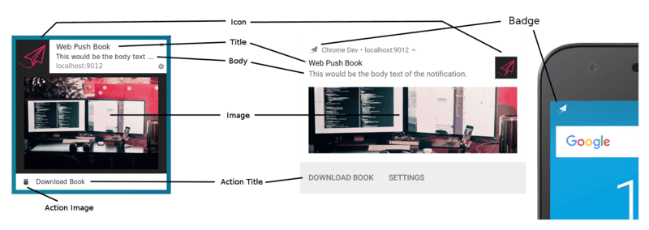

*Local file: [`assets/notifications/anatomy-notification-parts.png`](assets/notifications/anatomy-notification-parts.png). Source: web.dev, CC-BY 4.0. Cue Sheet currently uses only **title** + **body** + **tag** — none of icon/image/badge/actions.*

---

## 3. What Cue Sheet looks like on **macOS** (illustrative mockup)

web.dev and MDN have **no macOS or Safari** screenshots, and macOS is your platform — so here is a faithful mockup of Cue Sheet's actual notification (`Cue Sheet — in 5 min · 7:30 PM` + two cue lines) in the three macOS browsers. macOS routes all of them through **Notification Center**, top-right.

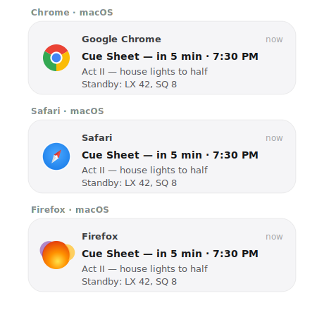

*Local file: [`assets/notifications/mockup-macos-cuesheet.svg`](assets/notifications/mockup-macos-cuesheet.svg). **Illustrative — not a screenshot.** Icons are approximations. The key, accurate point: because Cue Sheet sets **no `icon`**, macOS stamps the **browser's own app icon** (Chrome/Safari/Firefox) — there's no Cue Sheet branding, and the user can't remove that browser icon. This is the single biggest reason to consider adding an `icon`.*

---

## 4. Real screenshots by browser / OS

Downloaded from web.dev's [Displaying a Notification](https://web.dev/articles/push-notifications-display-a-notification) (content licensed **CC-BY 4.0**, © Google / Matt Gaunt). These are genuine screenshots. Coverage is Chrome/Firefox on **Windows, Linux, Android** — macOS/Safari are covered by the mockup above.

### No title set → browser fills it in (Chrome, Windows)
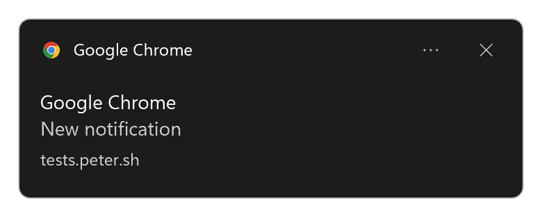

The most Cue-Sheet-relevant shot: with no icon and (here) no title, Windows shows the **Chrome logo + "Google Chrome"** and the origin. Cue Sheet *does* set a title, but the icon story is the same — you inherit the browser's branding. ([`local`](assets/notifications/chrome-windows-no-title-default-browser-name.png))

### Title + body

| Chrome (Linux) | Firefox (Windows) | Firefox (Linux) |
|---|---|---|
| 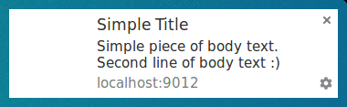 | 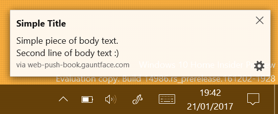 | 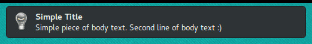 |

*Local: [chrome-linux-title-body.png](assets/notifications/chrome-linux-title-body.png) · [firefox-windows-title-body.png](assets/notifications/firefox-windows-title-body.png) · [firefox-linux-title-body.png](assets/notifications/firefox-linux-title-body.png)*

### With an `icon` (what adding one would buy you)

| Chrome (Linux) | Firefox (Linux) |
|---|---|
| 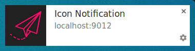 | 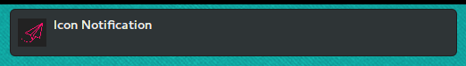 |

*Local: [chrome-linux-with-icon.png](assets/notifications/chrome-linux-with-icon.png) · [firefox-linux-with-icon.png](assets/notifications/firefox-linux-with-icon.png)*

### Options Cue Sheet does **not** use (and mostly can't, without a service worker)

| `image` — big preview (Chrome, Linux) | `actions` — buttons (Chrome, Linux) | `badge` — monochrome (Chrome, Android) |
|---|---|---|
| 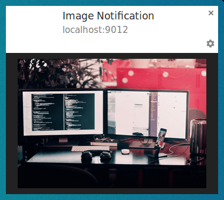 | 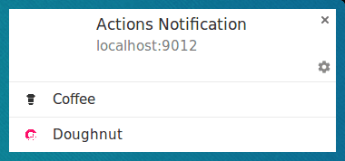 | 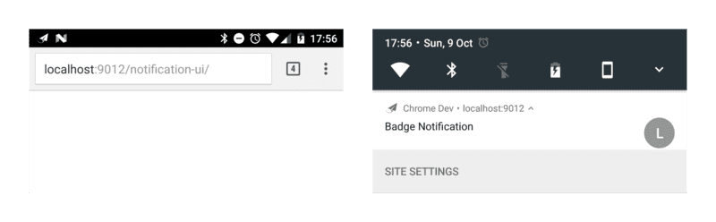 |

*`image`, `actions`, and `badge` require `ServiceWorkerRegistration.showNotification()` — the plain `new Notification()` constructor Cue Sheet uses ignores or throws on them — and macOS drops `image`/`actions` for Chrome/Firefox anyway. Local: [large-image](assets/notifications/chrome-linux-large-image.png) · [action-buttons](assets/notifications/chrome-linux-action-buttons.png) · [badge](assets/notifications/chrome-android-badge.png)*

---

## 5. Cross-browser cheat sheet

| Browser + OS | Who draws it | Position | Icon when none set | Notable |
|---|---|---|---|---|
| Chrome · macOS | macOS Notification Center | top-right | Chrome logo | `requireInteraction` works; **`image`/`actions` dropped** by macOS |
| Chrome · Windows | Windows toast / Action Center | bottom-right | Chrome logo | Richest: icon, image, actions, `requireInteraction` all render |
| Firefox · macOS | macOS Notification Center | top-right | Firefox logo | **No `requireInteraction`** (Mozilla declined); image/actions limited |
| Firefox · Windows | Windows toast | bottom-right | Firefox logo | title + body + icon reliably |
| Safari · macOS | macOS Notification Center | top-right | Safari / site icon | Web push since Safari 16; **ignores `requireInteraction`**; minimal options |

**Behaviour that's the same everywhere:**
- **Auto-dismiss is OS-controlled**, not spec-defined. Chrome desktop hides after ~20s (unless `requireInteraction`); then it lives in the OS notification center. Firefox/Safari follow the OS.
- **`tag` coalesces**: a new notification with the same `tag` *replaces* the previous one in place (per the [WHATWG spec](https://notifications.spec.whatwg.org/)) — consistent across all three. Cue Sheet tags per batch (`cuesheet-<ts>`), so each cue-time gets its own slot and re-renders cleanly. Add `renotify: true` if a repeat of the same tag should re-alert (sound/bounce) instead of swapping silently.

---

## 6. Recommendations for Cue Sheet

1. **Add an `icon`.** Biggest visible win, works on the plain constructor with no service worker, and replaces the "this came from your browser" look with Cue Sheet branding. A single-color 192×192 (or larger) PNG/SVG data-URI keeps the app single-file.
2. **Consider `renotify: true`** if a fresh cue at an already-used tag should actively re-alert.
3. **Skip `actions`, `image`, `badge`.** They need a service worker (breaks the single-file model) and macOS ignores `image`/`actions` for Chrome/Firefox anyway — near-zero payoff for a desktop watcher.
4. Keep `requireInteraction` in mind only as a Chrome-desktop nicety (Firefox/Safari ignore it) if you ever want a cue to stay pinned until clicked.

---

## 7. Local files in this bundle

All under [`assets/notifications/`](assets/notifications/):

- [`anatomy-notification-parts.png`](assets/notifications/anatomy-notification-parts.png) — labelled anatomy diagram
- [`mockup-macos-cuesheet.svg`](assets/notifications/mockup-macos-cuesheet.svg) — Cue Sheet on Chrome/Safari/Firefox, macOS *(mockup)*
- [`chrome-windows-no-title-default-browser-name.png`](assets/notifications/chrome-windows-no-title-default-browser-name.png)
- [`chrome-linux-title-body.png`](assets/notifications/chrome-linux-title-body.png)
- [`firefox-windows-title-body.png`](assets/notifications/firefox-windows-title-body.png)
- [`firefox-linux-title-body.png`](assets/notifications/firefox-linux-title-body.png)
- [`chrome-linux-with-icon.png`](assets/notifications/chrome-linux-with-icon.png)
- [`firefox-linux-with-icon.png`](assets/notifications/firefox-linux-with-icon.png)
- [`chrome-linux-large-image.png`](assets/notifications/chrome-linux-large-image.png)
- [`chrome-linux-action-buttons.png`](assets/notifications/chrome-linux-action-buttons.png)
- [`chrome-android-badge.png`](assets/notifications/chrome-android-badge.png)

---

## Sources

- [web.dev — Displaying a Notification](https://web.dev/articles/push-notifications-display-a-notification) — best illustrated anatomy; all PNGs here are from it (CC-BY 4.0).
- [MDN — Using the Notifications API](https://developer.mozilla.org/en-US/docs/Web/API/Notifications_API/Using_the_Notifications_API) — API guide; shows origin attribution ("via …").
- [MDN — Notification](https://developer.mozilla.org/en-US/docs/Web/API/Notification) — interface reference (options, `tag`).
- [WHATWG — Notifications API spec](https://notifications.spec.whatwg.org/) — authoritative `tag`/replace + option semantics.
- [push.foo](https://push.foo/) · [Peter Beverloo Notification Generator](https://tests.peter.sh/notification-generator/) · [web-push-book demos](https://web-push-book.gauntface.com/demos/notification-examples/) · [KenHerbert tester](https://www.kenherbert.dev/browser-notification-tester/) · [bennish.net test](https://www.bennish.net/web-notifications.html) — live playgrounds.
- [PushEngage — how push looks across browsers/OSes](https://www.pushengage.com/how-does-web-push-notification-appear-in-various-browsers/) — marketing gallery (lazy-loaded images; browse in a real browser).

*Image attribution: PNG screenshots © Google, from web.dev, used under [CC-BY 4.0](https://creativecommons.org/licenses/by/4.0/). The macOS SVG is an original mockup for this repo.*
